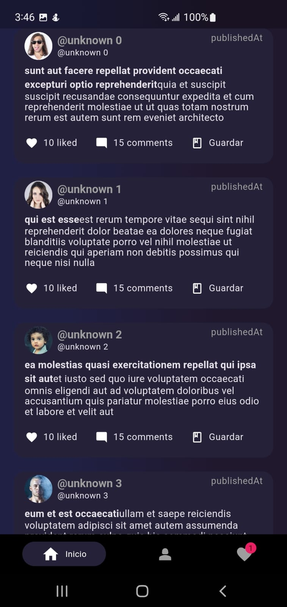
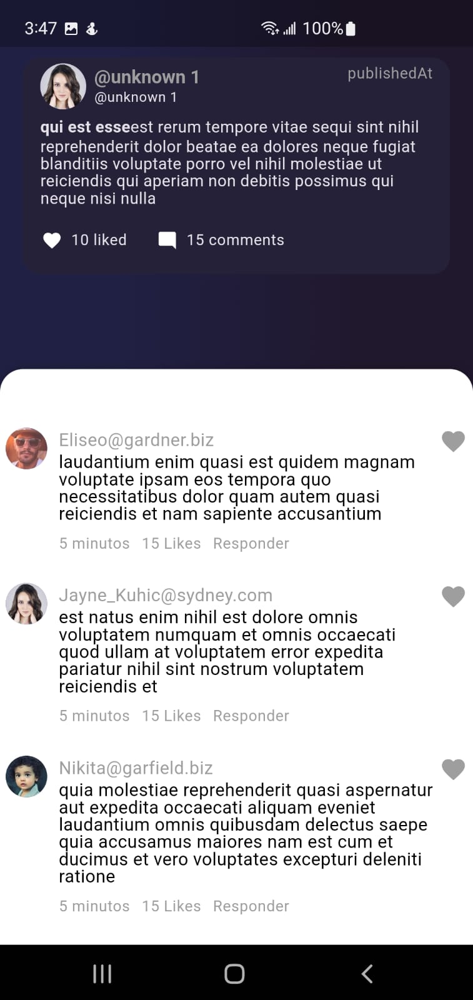
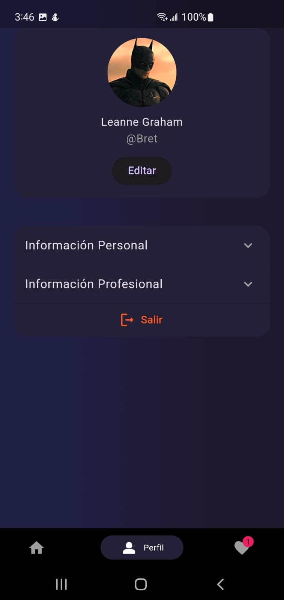

# Tizo Challange

# Descripción del Proyecto

Este proyecto es una prueba técnica desarrollada para **Tizo**. El objetivo es crear una aplicación móvil utilizando **Flutter** que cumpla con los siguientes requisitos:

## Requerimientos

### 1. Pantalla de Inicio (Feed de Publicaciones)

- La pantalla principal debe mostrar una lista de publicaciones con:
  - Un título
  - Un resumen
  - La fecha de publicación
- Los datos se obtienen de una API REST pública: [https://jsonplaceholder.typicode.com/posts](https://jsonplaceholder.typicode.com/posts).
- Implementación de **paginado** con **infinite scroll**, cargando 10 publicaciones a la vez.

### 2. Pantalla de Detalles de Publicación

- Al tocar una publicación, se navega a una pantalla que muestra:
  - El título completo
  - El cuerpo de la publicación
  - El autor
- También se deben mostrar los comentarios de la publicación obtenidos desde la API:
  - [https://jsonplaceholder.typicode.com/comments?postId={postId}](https://jsonplaceholder.typicode.com/comments?postId={postId}).
- Los comentarios se deben mostrar en un formato de lista debajo de los detalles de la publicación.

### 3. Funcionalidad de Guardado

- Los usuarios pueden "guardar" publicaciones para leerlas más tarde.
- Se utiliza almacenamiento local (como **shared_preferences** o **hive**) para almacenar las publicaciones guardadas.
- Las publicaciones guardadas deben ser accesibles desde una pestaña o sección separada llamada **"Guardados"** en la pantalla principal de la aplicación.

### 4. Pantalla de Perfil de Usuario

- El usuario podrá ver su nombre, correo electrónico y avatar en una pantalla de perfil.
- Los detalles del usuario se obtienen desde la API:
  - [https://jsonplaceholder.typicode.com/users/1](https://jsonplaceholder.typicode.com/users/1).
- Se incluye un botón para **"Cerrar sesión"** que redirige a la pantalla principal (sin funcionalidad completa).

### 5. Temas y Diseño Responsive

- La interfaz debe ser **responsive** y adaptarse a diferentes tamaños de pantalla, asegurando una experiencia de usuario consistente en dispositivos móviles.

---

Este proyecto tiene como objetivo demostrar habilidades en la integración de APIs, gestión de estados, manejo de errores, almacenamiento local y diseño responsive en aplicaciones móviles con **Flutter**.

---

## Tecnologías

Este proyecto utiliza las siguientes tecnologías:

- **Flutter**: Framework para crear aplicaciones nativas en iOS y Android.
- **Dart**: Lenguaje de programación utilizado en Flutter.
- **GetX**: Para la gestión del estado y la navegación.
- **Hive**: Base de datos local para almacenamiento rápido.

Incluye todas las dependencias tecnológicas necesarias para el proyecto.

---

## Features Principales

Aquí se listan las características clave que ofrece el proyecto:

- **Interfaz de usuario interactiva**: Con componentes adaptados a iOS y Android.
- **Scroll infinito**: Haciendo peticiones cada 10 elementos.
- **Gestión de datos locales**: Con Hive para almacenar información en el dispositivo sin conexión.
- **Navegación y manejo de estado con GetX**
- **Modo Offline**: Funcionalidad que permite al usuario interactuar sin conexión a Internet (BÁSICA).
- **Múltiples peticiones**

---

---

## Requisitos de Instalación

Antes de comenzar, asegúrate de tener instalados los siguientes elementos:

- Java 17
- Flutter 3.24

## Cómo Instalarlo

Sigue estos pasos para instalar y ejecutar el proyecto en tu máquina local:

1. **Clona el repositorio**:

   ```bash
   git clone https://github.com/Dalex19/tizo_challange.git

   ```

2. **Entra al directorio del proyecto**:

   ```bash
   cd el_repositorio

   ```

3. **Instala las dependencias**:

   ```bash
   flutter pub get

   ```

4. **Ejecuta el proyecto**:
   ```bash
   flutter flutter
   ```

## Capturas de Pantalla

### Pantalla de Inicio (Feed de Publicaciones)



### Detalles de Publicación



### Pantalla de Perfil de Usuario


